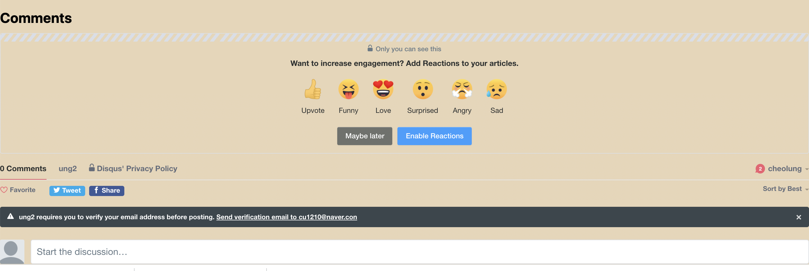

# 프로젝트 빌드 과정

1.Minimal mistakes 테마를 설치 <br>
- Click [here](https://github.com/topics/jekyll-theme) <br><br>

2.내 로컬 저장소에 clone
<br><br>

3.기본테마 수정(_config.yml) <br><br>

⦿ 수정내역
|카테고리|수정내역|
|:--|:--:|
|minimal_mistakes_skin : |"sunrise"|
|title : |"CheolungLog"|
|name : |"first blog"|
|location : |"Seoul, SomeWhere"|
|bio : |"Welcome!"|
|email : |"cu1210@naver.com"|
|locale : |"ko-KR"|
|breadcrumbs : |true|
|logo : |./img/chunsik.png|
```
values:
	show_date: true
date_format: "%Y-%m-%d"
```
<br><br>


4._posts 폴더 생성 후 게시글 post ! (2021-12-06-blog_game.md, 2021-12-07-ga.md)
<br><Br>

5.Disqus 에서 Website Name을 ung2로 지정 후 댓글 기능 추가<br>


<br><br>
6.Google analytics 추가 (포스트 참고)
<br><br>

7.favicon 추가 <br>

