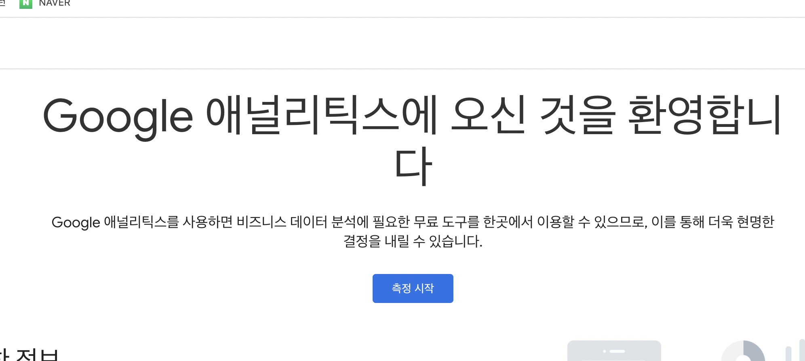
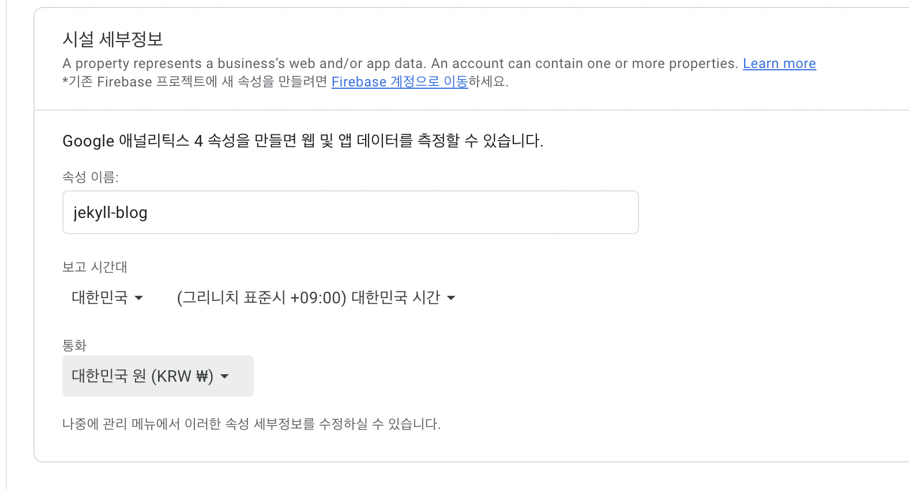
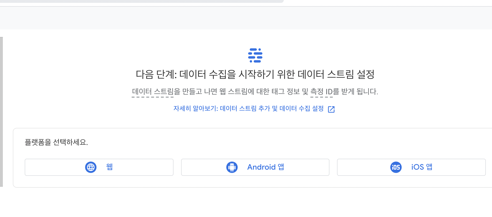
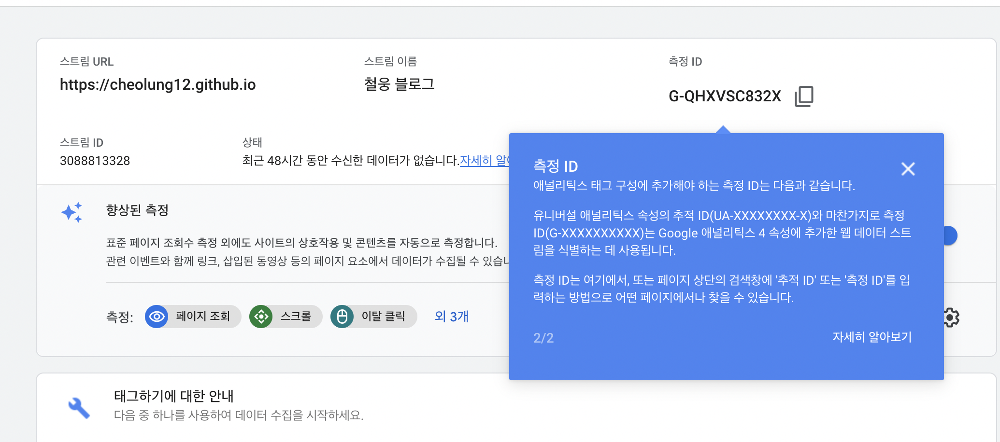
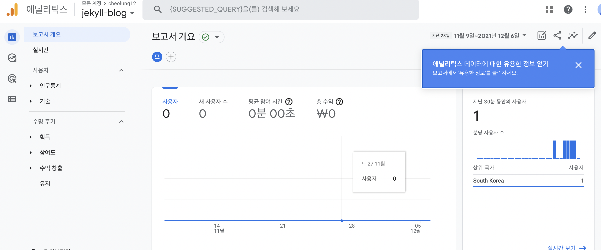

# Google Analytics 추가하기

1. 구글에 google analytics 검색 후 사이트 들어가서 측정 시작 누르기<br>
{: width="1000" height="400"}

2. 사이트 정보 입력 하기<br>
{: width="1000" height="400"}

3. 플랫폼은 웹을 선택 후 다시 정보 입력<br>
{: width="1000" height="400"}<br>

{: width="1000" height="400"}

4. 속성에서 추적 코드 확인 후 복사해놓기<br>
{: width="1000" height="400"}
   
5. _config.yml 의 analytics 부분에 다음과 같이 추적코드를 포함하여 입력
   
```
# Analytics
analytics:
  provider               : "google-gtag" 
  google:
    tracking_id          : "G-QHXVSC832X"
    anonymize_ip         :  false
```

6. git push 이 후에 google analytics 보고서를 통해 방문자 수를 확인해보자<br>
{: width="1000" height="400"}

